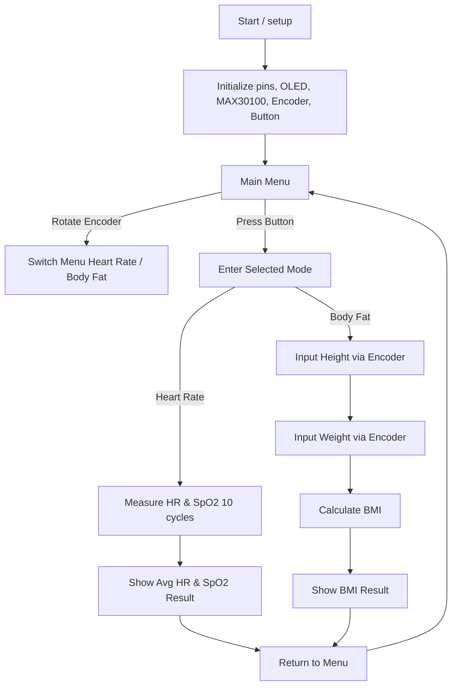

# __Vital Health Index VHI__
This is `R2 Chan Ui Sang Le B` 's repository for project's subject CPE-213 Microcontroller.

## Table of Contents
* [Introduction](#introduction)
* [Features](#features)
* [Components](#components)
* [How to use this Device](#how-to-use-this-device)
* [Circuit Diagram](#systems-circuit-diagram)
* [Block Diagram](#block-diagram-of-overall-workflow)
* [3D Model](#3d-model-of-device)
* [Actual Image](#actual-picture-of-device)
* [Demo](#demo)

## Overview 
> ### _Introduction_
This project aims to create device that measure heart rate, oxygen in user's blood and calculate user's BMI. This device is based on `ESP32 DOIT DEVKIT V1` and has `MAX30100 Pulse Oximeter` and `KY040 Rotary Encoder` acts as input and using `LED`, `Buzzer` and `Adafruit OLED 128x64 Display` acts as output.  
By using `ESP32` as main processor unit offer a power efficient and good computational speed combine with `Pulse Oximeter` which has heart rate sensor and blood level oxygen sensor this device can be use in many aplications such as in hostipal, clinic, etcs. Using `Rotary Encoder` alongside with `OLED display` to easily receive inputs from user and allow user to navigates through menus combine with `OLED Display` to show user interfaces increasing user's friendly element.  

> ### _Features_
1. Measure user's <ins>heart rate</ins>.
2. Measure user's <ins>blood oxygen level</ins>.
3. Calculate user's <ins>BMI</ins>.
4. Display results on OLED display.
  

> ### _Components_
### INPUTS
1. ESP32 DOIT DEVKIT V1.
2. Expansion Board for ESP32.
3. MAX30100 Pulse Oximeter and Heart-Rate Sensor IC 
4. KY040 Rotary Encoder
### OUTPUTS
5. LED
6. Buzzer
7. Adafruit OLED 128x64 Display
  

> ### How to use this device
1. Plug in powersource to device.
2. Using Rotary Encoder to navigates through menus.
    * Heart Rate Mode
        1. Place your finger above the sensor.
        2. Wait for 10s
        3. Result will be display on OLED screen.
        4. Push the Rotary Encoder to return to main menu.
    * BMI Calculator Mode
        1. Input weight by turning Rotary Encoder 
        2. Push the Rotary Encoder to proceed to next page.
        3. Do the same with height.
        4. results will be display on OLED screen.
        5. Push the Rotary Encoder to return to main menu.
3. Unplug if you finished using the device.
  

> ### System's Circuit Diagram
> 

  

> ### Block Diagram of Overall Workflow

  

> ### _3D Model of Device_

  

> ### _Actual Picture of Device_

  

> ### Demo
https://github.com/user-attachments/assets/4068e998-37fa-426f-a5e0-a2cf2def49fd

    

